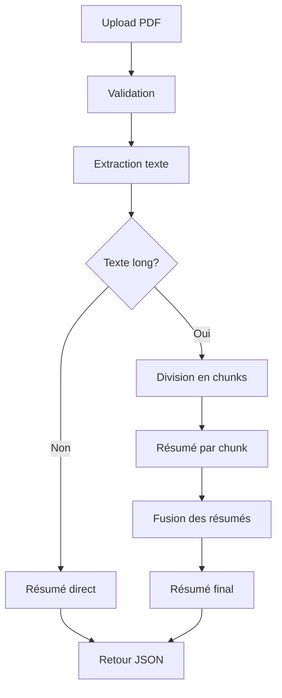

# 📄 API de Résumé de PDF

[](https://python.org)
[](https://fastapi.tiangolo.com)
[](https://huggingface.co/transformers)
[](https://opensource.org/licenses/MIT)

> 🚀 **API intelligente de résumé automatique de documents PDF** utilisant l'IA (modèle BART de Facebook)

## ✨ Fonctionnalités

- 📄 **Extraction de texte PDF** - Extraction automatique du contenu textuel
- 🧠 **Résumé IA** - Génération de résumés intelligents avec le modèle BART
- 📊 **Gestion des longs documents** - Division automatique en segments optimisés
- 🛡️ **Robustesse** - Gestion d'erreurs avancée et récupération automatique
- 🧹 **Sécurité** - Nettoyage automatique des fichiers temporaires
- 📝 **Documentation interactive** - Interface Swagger UI intégrée
- 📋 **Système de logs** - Logs détaillés avec fichiers quotidiens automatiques

## 🔧 Technologies utilisées

- **FastAPI** - Framework web moderne et performant
- **Transformers (HuggingFace)** - Modèle de résumé `facebook/bart-large-cnn`
- **PyMuPDF** - Extraction de texte PDF
- **Python 3.9+** - Langage de programmation

## 🚀 Installation

### Prérequis

- Python 3.9 ou supérieur
- pip ou conda

### Étapes d'installation

1. **Cloner le projet**
   ```bash
   git clone https://github.com/TheoPERSONNE/APOCALIPSSI.git
   cd APOCALIPSSI/backend/Api
   ```

2. **Installer les dépendances**
   ```bash
   pip install fastapi uvicorn transformers PyMuPDF python-multipart
   ```

3. **Lancer l'API**
   ```bash
   python app.py
   ```

L'API sera accessible sur : `http://localhost:8000`

## 📋 Endpoints

### 🏠 Page d'accueil
```
GET /
```
**Description :** Informations générales sur l'API

**Réponse :**
```json
{
  "message": "🚀 API de Résumé PDF - Intelligence Artificielle",
  "version": "1.0.0",
  "model": "facebook/bart-large-cnn",        "endpoints": {
            "documentation": "/docs",
            "resume_pdf": "/summarize_pdf/",
            "health": "/health",
            "alternative_docs": "/redoc",
            "openapi_schema": "/openapi.json"
        },
  "features": [
    "Extraction de texte PDF",
    "Résumé automatique IA",
    "Gestion des longs documents",
    "Nettoyage automatique"
  ]
}
```

### 📄 Résumer un PDF
```
POST /summarize_pdf/
```
**Description :** Génère un résumé automatique d'un document PDF

**Paramètres :**
- `file` : Fichier PDF à résumer (multipart/form-data)

**Réponse :**
```json
{
  "summary": "Résumé intelligent du document PDF..."
}
```

**Codes de réponse :**
- `200` : Résumé généré avec succès
- `400` : Erreur de validation (type de fichier, taille, etc.)
- `500` : Erreur serveur lors du traitement

### 🔍 État de santé
```
GET /health
```
**Description :** Vérification du bon fonctionnement de l'API et de ses dépendances

**Réponse :**
```json
{
  "status": "� Service en ligne",
  "timestamp": "2025-07-01T15:30:00.000Z",
  "model_status": "✅ Opérationnel",
  "dependencies": {
    "FastAPI": "✅ Opérationnel",
    "PyMuPDF": "✅ Opérationnel",
    "Transformers": "✅ Opérationnel"
  }
}
```

### 📖 Documentation interactive
```
GET /docs
```
**Description :** Interface Swagger UI pour tester l'API directement dans le navigateur

### 📚 Documentation alternative
```
GET /redoc
```
**Description :** Interface ReDoc pour une documentation alternative de l'API

### 📋 Schéma OpenAPI
```
GET /openapi.json
```
**Description :** Spécification OpenAPI/Swagger de l'API au format JSON

## 🎯 Utilisation

### Interface web (Swagger UI)
Accédez à `http://localhost:8000/docs` pour utiliser l'interface interactive.

### Documentation alternative (ReDoc)
Accédez à `http://localhost:8000/redoc` pour une documentation alternative.

### Test de l'état de santé
```bash
curl -X GET "http://localhost:8000/health" \
     -H "accept: application/json"
```

### Curl
```bash
# Résumer un PDF
curl -X POST "http://localhost:8000/summarize_pdf/" \
     -H "accept: application/json" \
     -H "Content-Type: multipart/form-data" \
     -F "file=@document.pdf"

# Vérifier l'état de santé
curl -X GET "http://localhost:8000/health" \
     -H "accept: application/json"

# Obtenir les informations de l'API
curl -X GET "http://localhost:8000/" \
     -H "accept: application/json"
```

### Python (requests)
```python
import requests

# Résumer un PDF
url = "http://localhost:8000/summarize_pdf/"
files = {"file": open("document.pdf", "rb")}
response = requests.post(url, files=files)
summary = response.json()["summary"]
print(summary)

# Vérifier l'état de santé
health_url = "http://localhost:8000/health"
health_response = requests.get(health_url)
print(health_response.json())

# Obtenir les informations de l'API
info_url = "http://localhost:8000/"
info_response = requests.get(info_url)
print(info_response.json())
```

### JavaScript (fetch)
```javascript
// Résumer un PDF
const formData = new FormData();
formData.append('file', fileInput.files[0]);

fetch('http://localhost:8000/summarize_pdf/', {
    method: 'POST',
    body: formData
})
.then(response => response.json())
.then(data => console.log(data.summary));

// Vérifier l'état de santé
fetch('http://localhost:8000/health')
.then(response => response.json())
.then(data => console.log('API Status:', data.status));

// Obtenir les informations de l'API
fetch('http://localhost:8000/')
.then(response => response.json())
.then(data => console.log('API Info:', data));
```

## 📊 Limitations et contraintes

| Critère | Limite |
|---------|--------|
| **Format de fichier** | PDF uniquement |
| **Taille maximale** | 10 MB |
| **Type de contenu** | Texte extractible (pas d'images scannées) |
| **Langues supportées** | Principalement anglais et français |
| **Temps de traitement** | 5-30 secondes selon la taille |

## 🔍 Architecture du résumé



### Stratégie de découpage
- **Textes courts** (≤500 mots) : Résumé direct
- **Textes longs** : Division en chunks de 500 mots → résumé individuel → fusion
- **En cas d'erreur** : Re-division en chunks de 300 mots avec paramètres réduits

## 📁 Structure du projet

```
Api/
├── app.py              # Application principale FastAPI
├── logs/               # Dossier des fichiers de logs
│   └── api_YYYYMMDD.log # Logs quotidiens automatiques
├── README.md           # Cette documentation
└── requirements.txt    # Dépendances (optionnel)
```

## 🐛 Dépannage

### Erreurs communes

**Erreur : "index out of range in self"**
- Solution : L'API gère automatiquement cette erreur en redécoupant le texte

**Erreur : "No module named 'fitz'"**
```bash
pip install PyMuPDF
```

**PDF vide ou illisible**
- Vérifiez que le PDF contient du texte sélectionnable
- Les images scannées ne sont pas supportées

### Logs et monitoring
L'API génère automatiquement des logs détaillés :

**📂 Emplacement des logs :**
```
Api/logs/api_YYYYMMDD.log
```

**📋 Contenu des logs :**
- Démarrages et arrêts de l'API
- Requêtes de résumé avec détails (nom fichier, taille, temps de traitement)
- Erreurs et avertissements
- Tests de santé du système

**🔍 Consultation des logs :**
- **Via l'API** : `GET /logs?lines=100`
- **Fichier direct** : Consultez `logs/api_YYYYMMDD.log`

**⚠️ Niveaux de logs :**
- `INFO` : Informations générales (fichier uniquement)
- `WARNING` : Avertissements (console + fichier)
- `ERROR` : Erreurs (console + fichier)

Pour un monitoring en temps réel :
```bash
tail -f logs/api_$(date +%Y%m%d).log
```

## 🔍 Exemples de logs

**📝 Log d'une requête réussie :**
```
2025-07-01 15:30:42 - pdf_summarizer_api - INFO - 📄 Nouvelle demande de résumé PDF - Fichier: rapport.pdf
2025-07-01 15:30:42 - pdf_summarizer_api - INFO - 📊 Taille du fichier: 2.34 MB
2025-07-01 15:30:42 - pdf_summarizer_api - INFO - 💾 Fichier temporaire créé: /tmp/tmpXYZ123.pdf
2025-07-01 15:30:43 - pdf_summarizer_api - INFO - 🔍 Extraction du texte en cours...
2025-07-01 15:30:43 - pdf_summarizer_api - INFO - 📝 Texte extrait: 1250 mots
2025-07-01 15:30:43 - pdf_summarizer_api - INFO - 🧠 Génération du résumé en cours...
2025-07-01 15:30:51 - pdf_summarizer_api - INFO - ✅ Résumé généré avec succès en 8.45s
2025-07-01 15:30:51 - pdf_summarizer_api - INFO - 📊 Résumé: 127 mots
2025-07-01 15:30:51 - pdf_summarizer_api - INFO - 🧹 Fichier temporaire supprimé
```

**❌ Log d'une erreur :**
```
2025-07-01 15:35:12 - pdf_summarizer_api - WARNING - ❌ Type de fichier invalide: document.txt
2025-07-01 15:36:05 - pdf_summarizer_api - WARNING - ❌ Fichier trop volumineux: 12.34 MB
```

## 🚀 Déploiement

### Développement
```bash
python app.py
```

### Production
```bash
uvicorn app:app --host 0.0.0.0 --port 8000 --workers 4
```

### Docker (optionnel)
```dockerfile
FROM python:3.9-slim
WORKDIR /app
COPY requirements.txt .
RUN pip install -r requirements.txt
COPY app.py .
CMD ["uvicorn", "app:app", "--host", "0.0.0.0", "--port", "8000"]
```

## 📈 Performance

- **Temps de démarrage** : ~30 secondes (chargement du modèle BART)
- **Traitement** : 2-10 secondes par PDF selon la taille
- **Mémoire** : ~2-4 GB (modèle BART)
- **Concurrence** : Supportée par FastAPI
- **Logs** : Fichiers quotidiens automatiques avec rotation
- **Monitoring** : Endpoint `/health` pour vérifications de santé

## 🤝 Contribution

1. Fork le projet
2. Créer une branche feature (`git checkout -b feature/AmazingFeature`)
3. Commit vos changements (`git commit -m 'Add AmazingFeature'`)
4. Push vers la branche (`git push origin feature/AmazingFeature`)
5. Ouvrir une Pull Request

## 📄 Licence

Ce projet est sous licence MIT. Voir le fichier [LICENSE](LICENSE) pour plus de détails.

## 🆘 Support

- **Documentation API** : `http://localhost:8000/docs`
- **Issues** : [GitHub Issues](https://github.com/votre-repo/issues)
- **Email** : support@example.com

## 🎯 Roadmap

- [ ] Support de formats supplémentaires (DOCX, TXT)
- [ ] Résumés multilingues
- [ ] API de résumé en streaming
- [ ] Interface web dédiée
- [ ] Support des PDF scannés (OCR)
- [x] **Système de logs avancé** ✅
- [ ] Dashboard de monitoring en temps réel
- [ ] Métriques de performance détaillées

---

**Développé avec ❤️ en utilisant FastAPI et l'IA**
